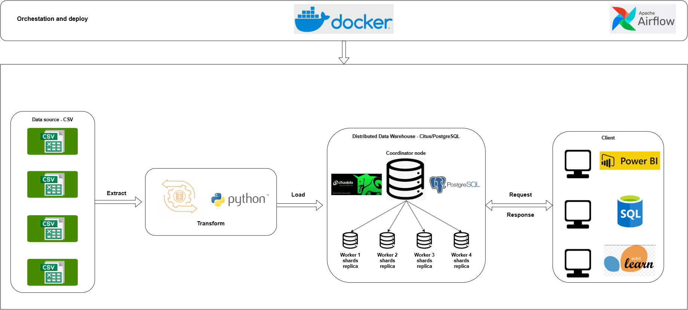

# Distributed E-commerce Data Warehouse using Citus/PostgreSQL

Đồ án cuối kỳ môn Cơ sở dữ liệu phân tán: xây dựng kho dữ liệu thương mại điện tử phân tán từ bộ dữ liệu Olist CSV.

Hệ thống sử dụng Python để thực hiện ETL, PostgreSQL/Citus để lưu trữ dữ liệu phân tán, Docker Compose để triển khai các container, và Apache Airflow để điều phối pipeline end-to-end.

## 1. Kiến trúc tổng quan


```text
Data source CSV
    -> Airflow DAG orchestration
    -> Python ETL pipeline
        -> Extract: kiểm tra file raw CSV
        -> Transform: chuyển đổi sang Star Schema
        -> Load: nạp dữ liệu vào Citus/PostgreSQL
    -> Distributed Data Warehouse
        -> 1 coordinator node
        -> 4 worker nodes
    -> SQL Client / BI Tool / Application
```

Cấu hình phân tán chính:

```text
Database: ecommerce_dw
Schema: ecommerce_dw
Fact table: fact_olist_orders
Distribution key: order_id
Sharding strategy: horizontal hash sharding
Shard count: 32
Replication factor: 2
Dimension tables: reference tables, được replicate tới tất cả worker nodes
```

## 2. Cấu trúc thư mục chính

```text
data/raw                  Chứa file CSV nguồn
data/warehouse            Chứa file CSV sau transform
dags                      Airflow DAG
etl                       Python ETL scripts
sql                       SQL schema, distributed table, benchmark, verify
docs                      Tài liệu thiết kế và kết quả kiểm thử
```

## 3. Raw CSV cần đặt trong data/raw

Các file CSV nguồn cần giữ đúng tên như sau:

```text
olist_orders_dataset.csv
olist_order_items_dataset.csv
olist_order_payments_dataset.csv
olist_order_reviews_dataset.csv
olist_customers_dataset.csv
olist_sellers_dataset.csv
olist_products_dataset.csv
product_category_name_translation.csv
```

Khi thay dataset khác, có thể thay dữ liệu bên trong nhưng nên giữ nguyên tên file và cấu trúc cột để pipeline ETL đọc đúng nguồn dữ liệu.

## 4. Cài thư viện Python

```powershell
cd C:\Users\ADMIN\Desktop\Final_Final_Final_Project
python -m pip install -r requirements.txt
```

Nếu đang dùng virtual environment:

```powershell
.\.venv\Scripts\Activate.ps1
python -m pip install -r requirements.txt
```

## 5. Chạy transform thủ công

```powershell
python .\etl\transform.py
```

Kết quả sẽ được tạo trong:

```text
data/warehouse
```

Bao gồm các bảng Star Schema dạng CSV:

```text
fact_olist_orders.csv
dim_customer.csv
dim_seller.csv
dim_product.csv
dim_date.csv
dim_payment.csv
dim_review.csv
```

## 6. Khởi động Citus cluster và Airflow

```powershell
docker compose up -d
docker compose ps
```

Các container chính:

```text
ecommerce-citus-coordinator
ecommerce-citus-worker-1
ecommerce-citus-worker-2
ecommerce-citus-worker-3
ecommerce-citus-worker-4
ecommerce-airflow-webserver
ecommerce-airflow-scheduler
```

Thông tin kết nối PostgreSQL/Citus từ máy host:

```text
host: 127.0.0.1
port: 15432
database: ecommerce_dw
user: postgres
password: postgres
```

## 7. Load dữ liệu vào Distributed Data Warehouse

Chạy lại transform trước khi load để đảm bảo dữ liệu warehouse CSV mới nhất:

```powershell
python .\etl\transform.py
```

Sau đó load vào Citus:

```powershell
python .\etl\load.py
```

Script load sẽ tự động:

```text
1. Kiểm tra hoặc tạo database ecommerce_dw.
2. Kết nối tới coordinator.
3. Đăng ký 4 worker nodes vào Citus cluster.
4. Chạy sql/01_create_schema.sql.
5. Chạy sql/02_create_distributed_tables.sql.
6. COPY các file CSV trong data/warehouse vào các bảng warehouse.
7. Tạo các role phân quyền trong sql/06_create_access_roles.sql.
```

## 8. Kiểm tra dữ liệu và trạng thái phân tán

Kết nối vào coordinator:

```powershell
docker exec -it ecommerce-citus-coordinator psql -U postgres -d ecommerce_dw
```

Một số lệnh kiểm tra:

```sql
SELECT COUNT(*) FROM ecommerce_dw.fact_olist_orders;

SELECT
    logicalrelid::regclass AS table_name,
    CASE partmethod
        WHEN 'h' THEN 'distributed'
        WHEN 'n' THEN 'reference'
        ELSE partmethod::text
    END AS citus_table_type
FROM pg_dist_partition
ORDER BY table_name;

SELECT nodeid, nodename, nodeport, isactive
FROM pg_dist_node
ORDER BY nodeid;
```

Có thể chạy file verify có sẵn:

```powershell
Get-Content .\sql\05_verify_citus.sql | docker exec -i ecommerce-citus-coordinator psql -U postgres -d ecommerce_dw -P pager=off
```

## 9. Benchmark query

Các query phân tích và benchmark nằm trong:

```text
sql/03_analytics_queries.sql
sql/04_benchmark_queries.sql
```

Chạy benchmark:

```powershell
Get-Content .\sql\04_benchmark_queries.sql | docker exec -i ecommerce-citus-coordinator psql -U postgres -d ecommerce_dw -P pager=off
```

Kết quả benchmark đã được ghi chú trong:

```text
docs/benchmark_summary.md
docs/benchmark_citus_result.txt
```

## 10. Airflow orchestration

Airflow được dùng để điều phối pipeline ETL end-to-end.

Truy cập Airflow UI:

```text
http://localhost:8080
```

Tài khoản demo:

```text
username: admin
password: admin
```

DAG chính:

```text
ecommerce_distributed_dw_etl
```

Luồng task:

```text
extract_raw_files -> transform_to_star_schema -> load_to_citus -> verify_warehouse
```

Trigger DAG bằng CLI:

```powershell
docker exec ecommerce-airflow-scheduler airflow dags trigger ecommerce_distributed_dw_etl
```

Kiểm tra trạng thái DAG run:

```powershell
docker exec ecommerce-airflow-scheduler airflow dags list-runs -d ecommerce_distributed_dw_etl --no-backfill -o table
```

Tài liệu chi tiết:

```text
docs/orchestration_airflow.md
```

## 11. Phân quyền truy cập

Project có các role demo phục vụ báo cáo và kiểm thử:

```text
readonly_user    Chỉ được SELECT dữ liệu
dashboard_user   Chỉ được SELECT dữ liệu, dùng cho dashboard/BI
etl_user         Được load và cập nhật dữ liệu phục vụ ETL
postgres         Admin, chỉ dùng cho quản trị hệ thống
```

Thông tin chi tiết nằm trong:

```text
sql/06_create_access_roles.sql
docs/access_control_and_network.md
```

## 12. Public trong mạng LAN

Coordinator được expose ra máy host qua port 15432. Thiết bị khác cùng mạng LAN có thể kết nối bằng IP của máy chạy Docker.

Ví dụ:

```text
host: 192.168.100.192
port: 15432
database: ecommerce_dw
username: readonly_user
password: Readonly@2026!
```

Lưu ý: IP LAN chỉ dùng được trong cùng mạng nội bộ. Nếu muốn truy cập từ Internet, cần triển khai lên cloud/VPS, dùng VPN như Tailscale, hoặc cấu hình port forwarding có kiểm soát.

## 13. Tài liệu báo cáo

Một số tài liệu đã chuẩn bị trong thư mục docs:

```text
docs/schema_design.md
docs/distributed_replication_design.md
docs/node_storage_summary.md
docs/replication_test.md
docs/benchmark_summary.md
docs/access_control_and_network.md
docs/orchestration_airflow.md
```


